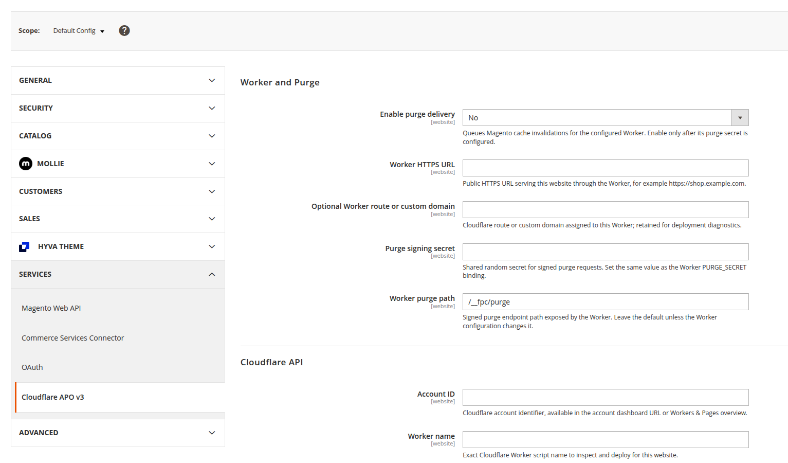

# Cloudflare full-page cache for Magento 2

A Magento full-page cache that does not need a Varnish server.

This package puts the public storefront cache on Cloudflare. Anonymous product,
category, CMS, and other public pages can be served near the visitor, while
customer sessions, carts, checkout, administration, and other private requests
continue to Magento.

The Magento module supplies the store-specific configuration and sends cache
invalidations when Magento content changes. The Worker contains the request and
cache policy. Page bodies are not stored in Magento, Redis, or Worker KV.



## Why use it

- No separate Varnish host to install, size, monitor, or keep in RAM.
- The cache is distributed across Cloudflare instead of living on one server.
- Traffic is not limited by the memory or CPU of a fixed cache VM.
- Smaller stores can start on the limited
  [Cloudflare Workers Free plan](https://developers.cloudflare.com/workers/platform/pricing/).
- Magento cache tags trigger targeted invalidation, with a full purge available
  for broader cache flushes.
- Private Magento traffic bypasses the shared cache before it reaches the cached
  Worker entrypoint.

Cloudflare usage is not unconditionally free, and no service is literally
infinite. Charges and limits depend on the Cloudflare plan. The practical
difference is that cache capacity follows Cloudflare's network instead of a
Varnish machine attached to the Magento stack.

## Requirements

- Magento 2 with PHP 8.1 or later;
- a Cloudflare account with Workers available;
- Composer;
- Node.js and npm for the local Worker build.

The Magento origin must have a hostname that the Worker can reach without
routing back through the Worker itself.

## Install the Magento module

Install the Composer package from the repository configured for your Magento
project:

```sh
composer require merchantduo/magento2-cloudflare-apo
bin/magento module:enable MerchantDuo_CloudflareApo
bin/magento setup:upgrade
```

For a production installation, run the normal deployment steps used by the
store, including DI compilation and cache cleaning:

```sh
bin/magento setup:di:compile
bin/magento cache:clean
```

## Configure it

Open Stores > Configuration > Services > Cloudflare APO v3 and choose the
website scope. Set:

- the Magento origin hostname and protocol;
- the Cloudflare account ID, Worker name, and scoped API token;
- the public Worker URL and purge path;
- a purge signing secret;
- the cache lifetime and stale period.

Use a scoped Cloudflare API token. Global API keys are not supported. Keep the
API token and purge signing secret separate.

Test access and build the website-specific Worker:

```sh
bin/magento cloudflare-apo:worker:connection --website=1
bin/magento cloudflare-apo:worker:build --website=1
```

The build report prints its build hash. The validated Worker is written to:

```text
var/merchantduo-cloudflare-apo/build/<website-id>/<build-hash>/
```

## Deploy the Worker

The current module builds and validates the Worker but does not upload or
activate it. Deploy the generated workspace with Wrangler:

```sh
cd var/merchantduo-cloudflare-apo/build/<website-id>/<build-hash>
npx wrangler login
npx wrangler deploy --name <worker-name>
npx wrangler secret put PURGE_SECRET --name <worker-name>
```

Enter the same value for `PURGE_SECRET` that you saved as the Magento purge
signing secret. Attach the Worker to the storefront route or custom domain in
Cloudflare, then set its public URL in Magento.

Enable purge delivery only after the Worker responds on that URL. Magento
queues cache-tag and full-flush requests and sends them from cron. The queue can
also be processed manually:

```sh
bin/magento cloudflare-apo:cache:purge
```

That command delivers pending queue entries; it does not create a new full
purge by itself.

## Current status

The Worker policy, Magento configuration, local build, Cloudflare connection
test, API logging, and signed purge queue are implemented. Worker deployment,
rollback, Magento admin action buttons, and the Cache Management page action are
not implemented yet.

See the [module README](magento/MerchantDuo/CloudflareApo/README.md) for module
settings and operations. [architecture.md](architecture.md) documents the
request and cache boundaries.
